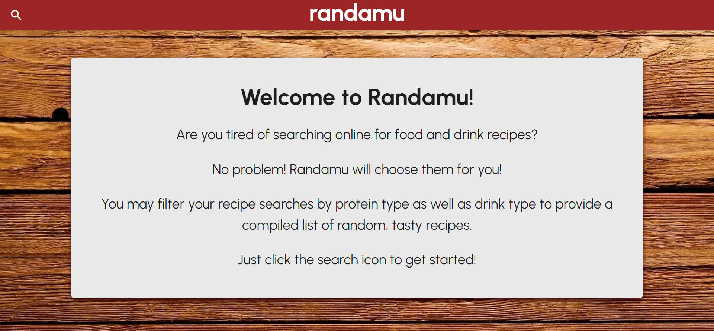
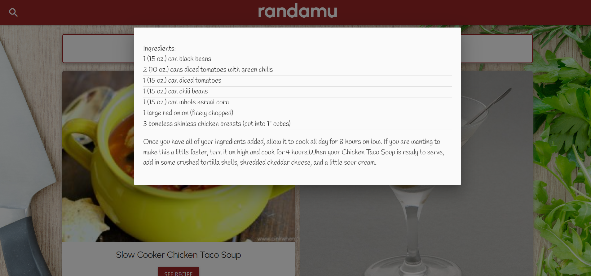

<h1 align="center">Randamu</h1>

A Food and Drink Recipe Generator
 

## About The Project

When deciding what road to take for this group project, we all found one common passion: FOOD. The idea started as a way to pair a cocktail with a certain recipe, but then we thought, "What if someone would like multiple options?" From there we decided to create a food and drink generator that displays five different food and drink recipes.    

After pressing the search icon, the user is prompted to provide a protein type and a drink type to create list of food and drink recipes that are random yet concise. From there, each recipe will display all ingredients, ingredient amounts, and cooking instructions.    

If you would like to give it a try, please visit the link listed below for our live website!    

Let's get to cooking!    

## Links

- [Repo](https://github.com/courtneyfarzam/Randamu "<project-name> Repo")

- [Live Website](https://courtneyfarzam.github.io/Randamu/ "Live View")

- [Bugs](https://courtneyfarzam.github.io/Randamu/issues "Issues Page")

- [Spoonacular](https://spoonacular.com/food-api/docs "API")

- [The Cocktail DB](https://www.thecocktaildb.com/api.php "API")

## Screenshots

## Built With

- JavaScript
- jQuery
- Materialize
- HTML
- CSS

## Contributors

**Courtney Ashley**

- [Profile](https://github.com/courtneyfarzam "Rohit jain")

**Tristan Wilson**

- [Profile](https://github.com/TristanW63 "Rohit jain")

**Ben Billings**

- [Profile](https://github.com/benbillings "Rohit jain")

**Lindsay Bae**

- [Profile](https://github.com/baelindsay "Rohit jain")

## 🤝 Support

Contributions, issues, and feature requests are welcome!

Give a ⭐️ if you like this project!

